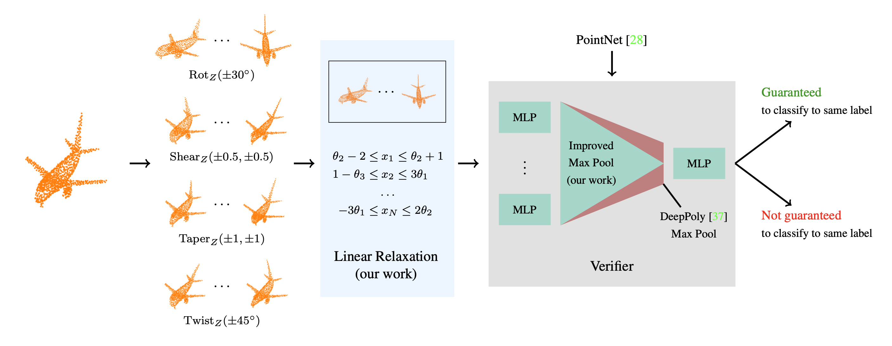

# Robustness Certification for Point Cloud Models <a href="https://www.sri.inf.ethz.ch/"></a>



## Abstract

The use of deep 3D point cloud models in safety-critical applications, such as autonomous driving, dictates the need to
certify the robustness of these models to semantic transformations. This is technically challenging as it requires a
scalable verifier tailored to point cloud models that handles a wide range of semantic 3D transformations. In this work,
we address this challenge and introduce 3DCertify, the first verifier able to certify robustness of point cloud models.
3DCertify is based on two key insights: (i) a generic relaxation based on first-order Taylor approximations, applicable
to any differentiable transformation, and (ii) a precise relaxation for global feature pooling, which is more complex
than pointwise activations (e.g., ReLU or sigmoid) but commonly employed in point cloud models. We demonstrate the
effectiveness of 3DCertify by performing an extensive evaluation on a wide range of 3D transformations (e.g., rotation,
twisting) for both classification and part segmentation tasks. For example, we can certify robustness against rotations
by ±60° for 95.7% of point clouds, and our max pool relaxation increases certification by up to 15.6%.

Paper Link: [arXiv](https://arxiv.org/abs/2103.16652)

## Setup Instructions

Clone this repository, including all submodules:

```bash
git clone --recurse-submodules https://github.com/eth-sri/3dcertify.git
```

Create a [conda](https://www.anaconda.com/products/individual) environment with the required dependencies:

```bash
conda env create -f environment.yml
conda activate 3dcertify
```

Setup dependencies and install ERAN:

```bash
cd ERAN && ./install.sh && cd ..
```

For DeepG3D relaxations, install Deepg3D (see also `deepg3d/README.md`):

```bash
cd deepg3d/code
mkdir build
make deepg_pointclouds
cd ../..
```

For experiments using auto_LiRPA, install auto_LiRPA (see also `auto_LiRPA/README.md`):

```bash
cd auto_LiRPA
python setup.py develop
git apply ../auto_LiRPA.diff
cd ..
```   

DeepG3D and some parts of DeepPoly use the GUROBI solver for certification. To run our code, apply for and download
an [academic GUROBI License](https://www.gurobi.com/academia/academic-program-and-licenses).

## Run Certification

All experiments from our paper can be reproduced by running the commands listed below with appropriate parameters. Some
basic pretrained models are provided with this repository in `models/`, all additional models used in our experiments
can be downloaded at https://files.sri.inf.ethz.ch/pointclouds/pretrained-models.zip or via the script in
`models/download_models.sh`. Alternatively, you can train you own models using our training scripts `train_*.py`.

_Note: the datasets will be downloaded and processed automatically the first time the script is used. Depending on
processing power, this may take several hours._

### Semantic Transformations using Taylor3D

```bash
python verify_transformation.py \
    --model models/64p_natural.pth \
    --num_points 64 \
    --transformation RotationZ \
    --theta 1deg \
    --intervals 1 \
    --relaxation taylor \
    --pooling improved_max \
    --experiment example1
```

Available transformations: `RotationX`, `RotationY`, `RotationZ`, `TwistingZ`, `TaperingZ`, `ShearingZ`

For automatic composition of arbitrary transformations chain them using a + symbol, e.g. `RotateZ+RotateX` or
`TaperingZ+TwistingZ+RotationZ`.

A detailed description of all parameters and their possible values can be accessed via the integrated help
`python verify_transformation.py -h`.

### Point Perturbation

```bash
python verify_perturbation.py \
    --model models/64p_ibp.pth \
    --num_points 64 \
    --eps 0.01 \
    --pooling improved_max \
    --experiment example2
```

### Semantic Transformations using DeepG3D

Compute relaxations with DeepG3D:

1. Create a directory with a config file with parameters and relaxations, such as
   `deepg3d/code/examples/modelnet40_64p_rotationz_theta_1_intervals_1/config.txt`. Refer to the
   [Deepg3D README](deepg3d/README.md) for more information.
2. enter the `deepg3d/code` directory and run
   `.build/deepg_pointclouds examples/modelnet40_64p_rotationz_theta_1_intervals_1`

Then verify using 3DCertify:

```bash
python verify_deepg.py \
    --model models/64p_natural.pth \
    --spec-dir deepg3d/code/examples/modelnet40_64p_rotationz_theta_1_intervals_1 \
    --num_points 64 \
    --pooling improved_max \
    --experiment example3
```

### Part Segmentation

```bash
python verify_segmentation.py \
    --model models/64p_segmentation.pth \
    --num_points 64 \
    --transformation RotationZ \
    --theta 1deg \
    --intervals 1 \
    --relaxation taylor \
    --experiment example4
```

### Transformation using auto LiRPA

```bash
python verify_lirpa.py \
    --model models/64p_natural.pth \
    --num_points 64 \
    --theta 1deg \
    --experiment example5
```

## Citing This Work

```
@article{lorenz2021pointclouds,
    title   = {Robustness Certification for Point Cloud Models},
    author  = {Lorenz, Tobias and
               Ruoss, Anian and
               Balunovi{\'c}, Mislav and
               Singh, Gagandeep and
               Vechev, Martin},
    journal = {arXiv preprint arXiv:2103.16652},
    year    = {2021}
}
```

## Contributors

* [Tobias Lorenz](https://www.t-lorenz.com) (tobias.lorenz@cispa.de)
* Anian Ruoss (anian.ruoss@inf.ethz.ch)
* [Mislav Balunović](https://www.sri.inf.ethz.ch/people/mislav) (mislav.balunovic@inf.ethz.ch)
* [Gagandeep Singh](https://ggndpsngh.github.io/) (ggnds@illinois.edu)
* [Martin Vechev](https://www.sri.inf.ethz.ch/people/martin) (martin.vechev@inf.ethz.ch)

## License

Licensed under the [Apache-2.0 License](https://www.apache.org/licenses/LICENSE-2.0)
